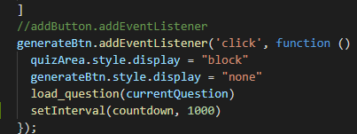

# Code Quiz

This is a project where we make a code quiz and use javascript to animate and time the quiz.

## Code Snip

### Challenges

When writing this I struggled with the timer function. This was my first time working with timers 
and I learned a lot. I figured out that the timer needed to be in miliseconds (1000) and then when I first
wrote the code I put it in the quiz questions. Every time a new question loaded it would make the timer go faster because it 
was in the wrong line of code. After moving it outside of that function and adding it to the event listener of click 
it worked correctly. 

## Built With

* [Font reference](https://siteimprove.com/en-us/accessibility/most-accessible-fonts/)
* [HTML reference](https://github.com/Alix1713/codequiz)

## Deployed Link
* https://alix1713.github.io/codequiz/
* https://github.com/Alix1713/codequiz

## Authors

* Alix Friedman

Portfolio on next project!

## Acknowledgments

* Thanks to our awesome class discord for having some great info!